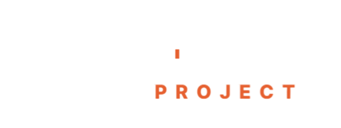
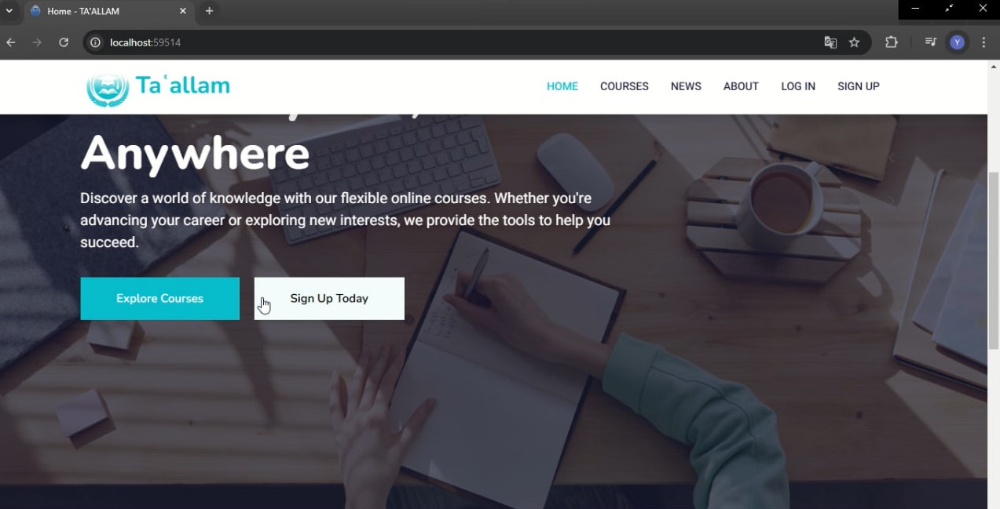

# Ta'allam - Training Center Management Web Application



## 📌 Introduction

**Ta'allam** is a cutting-edge web application designed to revolutionize the management of training centers. Built with **ASP.NET MVC** and **C#**, Ta'allam provides a centralized, scalable, and intuitive platform for managing training sessions, trainers, participants, payments, and certifications. Whether you're a training center administrator, a trainer, or a participant, Ta'allam empowers you to streamline operations, enhance learning experiences, and achieve your goals efficiently.  

---

## 🚀 Key Features  

### 👤 **User Roles**  
- **Guests**: Browse available training sessions, apply filters, and pre-register for courses.  
- **Participants**: Register for courses, manage profiles, track progress, and earn certificates upon completion.  
- **Trainers**: Create and manage training sessions, monitor participant progress, and deliver impactful learning experiences.  
- **Administrators**: Oversee users, manage courses, handle payments, and maintain the platform with ease.  

### 🔥 **Core Functionalities**  
- **Interactive Dashboard**: Gain real-time insights into courses, users, and payments with a visually appealing and user-friendly dashboard.  
- **AI-Powered Recommendations**: Leverage the **Mistral AI API** to provide personalized course recommendations based on user preferences and behavior.  
- **Secure Authentication**: Ensure data security with role-based access control and encrypted user data.  
- **Automated Certification**: Generate and issue PDF certificates automatically upon course completion using **DinkToPdf**.  
- **News & Announcements**: Stay updated with the latest trends and news in technology and cybersecurity.  
- **Responsive Design**: Enjoy a seamless experience across desktop and mobile devices.  

---

## 🛠️ Technologies Used  

| Technology               | Purpose                                   |  
|--------------------------|-------------------------------------------|  
| **ASP.NET MVC**          | Backend framework for robust web development. |  
| **C#**                   | Primary programming language for backend logic. |  
| **Entity Framework (Code First)** | Object-Relational Mapping (ORM) for database management. |  
| **Bootstrap & jQuery**   | Frontend styling and interactivity.       |  
| **DinkToPdf**            | PDF generation for automated certifications. |  
| **Newtonsoft.Json**      | JSON handling for API integration.        |  
| **Mistral AI API**       | AI-powered course recommendations.       |  
| **SQL Server**           | Relational database management system.    |  

---

## 🎯 System Architecture
```
Client (Browser) → ASP.NET MVC → Entity Framework → SQL Server
```

## 📸 Screenshots

  
*Home page for Users* 

  
*Interactive Dashboard for Administrators*  

  
*Course Management Interface for Trainers*  

  
*Automatically Generated PDF Certificate*  

---

## 🎥 Video Demo  

[](https://your-video-link-here.com)  
*Click to watch the demo video*  

---
## 📦 Installation & Setup

### Prerequisites  
- .NET SDK (version 6.0 or higher)  
- SQL Server  
- Git
 
### Steps
1. **Clone the Repository**
   ```sh
   git clone https://github.com/yourusername/taallam.git
   cd taallam
   ```
2. **Configure the Database**
   - Update `appsettings.json` with your SQL Server connection string.
   - Run database migrations:
     ```sh
     dotnet ef database update
     ```
3. **Run the Application**
   ```sh
   dotnet run
   ```
4. **Access the Web App**
   Open your browser and navigate to `http://localhost:5000`

## 📝 Future Enhancements
- Implement online payment integration.
- Add AI-driven course recommendations.
- Introduce multi-language support.
- Enable real-time chat between trainers and participants.

## 🤝 Contributing
We welcome contributions! Feel free to fork this repository, create a feature branch, and submit a pull request.


## 📧 Contact
For any inquiries or contributions, reach out to:
- **Zakariae Azila** | **Ismail Achibat** | **Yassine Moulat El Ali** | **Marouane Abeqqal**
- Email: yassine.moulatelali@usmba.ac.ma
- GitHub: [@Yassine-xflash](https://github.com/Yassine-xflash)

---
💡 *Empowering Learning Through Technology!*
